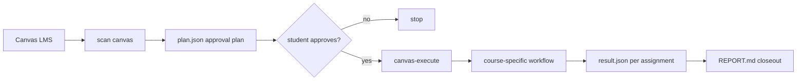

# Canvas Pilot

[](./LICENSE)
[](https://www.python.org/downloads/)

Canvas Pilot is a local-first AI agent that learns each Canvas course's
recurring assignment pattern, then reuses that pattern through scan -> approval
-> execute.

It scans upcoming Canvas LMS assignments, proposes a student-review approval
plan, and dispatches approved work into course-specific workflows that produce
review-ready drafts and run reports.

It is not another Canvas API wrapper. Canvas MCP servers let an agent access
Canvas; Canvas Pilot turns repeated course patterns into reusable workflows.

Codex is the primary driver. The legacy Claude Code path is preserved while the
project completes the migration.

---

## Why it is different

| Layer | Canvas MCP servers | Canvas Pilot |
|---|---|---|
| Canvas access | Expose Canvas API tools to an agent | Uses Canvas access as one input to a workflow |
| Repeated coursework | The agent asks and reasons again each time | The system learns the course pattern once and reuses it weekly |
| Student control | Depends on the host agent's behavior | Enforced by scan -> approval -> execute boundaries |
| Output | Tool responses, summaries, or ad hoc drafts | Drafts, result files, and a run report for review |

See [Canvas Pilot vs Canvas MCP](./docs/COMPARISON.md) for the longer
comparison.

## Workflow



## Quick demo

A typical interaction once you're fully configured:

```
You (in Codex or Claude Code, this directory):  scan canvas

Canvas Pilot:
    URGENT (next 72h)
    | # | course        | assignment       | due           | proposed skill |
    | 1 | Code Course A | Set 3 Problem 1  | 4/25 23:59    | code-course workflow |
    | 2 | Writing Course| Tue Wk5 HW Scan  | 4/27 12:30    | reading-annotation workflow |
    SOON (3-7d)
    | 3 | Quiz Course   | Section 5        | 5/01 23:59    | quiz workflow |

    Reply: "approve all" / "approve 1, 2" / "urgent only" / "cancel"

You:                                    approve all

Canvas Pilot:
    [dispatches each item sequentially, runs the per-course skill,
     produces a draft under runs/<today>/<assignment>/draft/,
     and writes a status to result.json]

    Done. REPORT.md written at runs/<today>/REPORT.md.
    Drafts mirrored to final_drafts/ for review.
```

You review the drafts and upload manually by default. Auto-submit only happens
when a specific per-course workflow has standing authorization and its
verification gate passes.

Public-safe examples live in [examples/](./examples/).

---

## Who this is for

- Students whose school uses Canvas LMS.
- Whose coursework includes a high share of repeating-structure assignments
  (weekly problem sets, weekly readings, weekly quizzes).
- Who want an AI to handle the boring orchestration (scan, dispatch, draft) but
  keep the human firmly in the loop for review and submission.
- Who already use Codex, or who are preserving an existing Claude Code workflow.

This is **not** a "submit my homework for me" tool. The default behavior is
*produce drafts, you submit*. Auto-submit is opt-in per skill, per assignment
type, with a verification gate in front.

---

## The product flow

There is **one entry point**: you say `scan canvas` in an agent session in this
directory. Everything else is a branch that `canvas-scan` decides based on
filesystem state.

```
You: "scan canvas"
  +-- canvas-scan self-check
      |
      +-- Missing Canvas config
      |   +-- canvas-setup
      |       1. Ask for the Canvas URL.
      |       2. Install Playwright + Chromium if needed.
      |       3. Open a browser for one login.
      |       4. List active courses and ask which to track.
      |       5. Hand off to canvas-bootstrap.
      |
      +-- Config exists, but no course routes exist
      |   +-- canvas-bootstrap
      |       1. Configure one course cluster.
      |       2. Identify the recurring assignment pattern.
      |       3. Ask one batched set of setup questions.
      |       4. Write a private local overlay.
      |       5. Calibrate with a real draft when available.
      |
      +-- Config and routes exist
          +-- Normal scan
              1. List pending work.
              2. Write plan.json.
              3. Stop for student approval.
              4. canvas-execute dispatches approved items.
              5. Each item writes result.json.
              6. REPORT.md closes the run.
```

Two non-obvious things about this flow:

1. **`canvas-bootstrap` is single-cluster on purpose.** A typical student has
   3-4 trackable courses. Configuring all four in one session means a wall of
   text you can't reason about. Configuring one, walking away, coming back
   tomorrow for the next gives you a tangible deliverable per session and lets
   you reuse what you learned from the first cluster when you do the next.

2. **The first time you run a per-course skill, it is a co-authoring
   session with you, not a one-shot.** `canvas-bootstrap`'s overlay v1 is the
   skill's best guess from reading the cluster. v2 is what you actually want,
   and it only exists after you've reviewed a real draft and your feedback has
   been categorized. Plan for ~30 minutes per cluster for the first-run loop.
   Subsequent runs of the same skill are non-interactive.

---

## Setup walkthrough

### First time on this machine (you're unconfigured)

1. Clone this repo somewhere local.
2. Open the folder in Codex. The legacy Claude Code path is still preserved
   while the migration finishes.
3. Say `scan canvas` (or anything similar - "check my Canvas" or "plan my
   assignments").

The agent dispatches the `canvas-scan` skill. It sees no `.env` and
auto-dispatches `canvas-setup`:

- Asks for your Canvas instance URL (e.g. `canvas.<your-school>.edu`).
- Installs Playwright + Chromium silently (~150 MB, one-time).
- Opens a browser. You log in to Canvas with your school SSO once.
  The skill captures the session cookie and stores it locally.
- Lists your active courses. You pick which ones to track.

`canvas-setup` then hands off to `canvas-bootstrap`, which starts
configuring your **first** course. You pick a cluster from the
recommendation list. The skill investigates it silently, asks you ~5
questions in one batch, writes the overlay, and either (a) runs a
calibration loop on a pending real assignment if one exists, or (b)
defers calibration to your next scan.

### Subsequent sessions

You say `scan canvas`. If `courses.yaml.routes` has at least one entry
but not all your courses, you get the normal scan PLUS a one-line
reminder that other courses are still unconfigured. You re-trigger
`canvas-bootstrap` whenever you want to configure another.

Once all your courses are configured, `scan canvas` is the only command
you ever need:

```
scan canvas
   -> review plan
   -> "approve all" / "approve 1, 2" / "urgent only" / "cancel"
   -> wait for drafts
   -> read REPORT.md, eyeball final_drafts/, upload manually (or rely on
     standing auto-submit authorization for skills you've granted it to)
```

You answer ~3 questions per cluster and log into Canvas once per
session-cookie-expiry. Everything else happens through the local agent tooling.

Codex manual setup docs are still being refreshed; use the in-agent setup flow
above for now.

---

## Core Canvas skills

Canvas Pilot ships Codex skills under `.agents/skills/`. Five are
framework-level (you use them as-is on any course). The per-course skeletons
load a local overlay file describing your specific school and instructor. One
additional skill (`canvas-essay`) is part of the writing-course handler. One
catch-all (`canvas-generic`) handles assignments that don't fit any of the
specific skills - it discovers the spec, designs a pipeline, and writes a draft
at runtime, without an overlay. Legacy Claude skill mirrors remain under
`.claude/skills/` while the migration is preserved.

### Framework skills

| Skill | What it does |
|---|---|
| `canvas-setup` | First-run install: ask for Canvas URL, silent dependency install, pop browser for one login, list courses, save selection. Auto-dispatched by `canvas-scan` when `.env` is missing. |
| `canvas-bootstrap` | Surveys a new course's recurring patterns and drafts a per-course overlay. Runs one cluster per invocation, scope-first. Includes the first-run calibration loop that turns the student's feedback on a real draft into overlay v2. |
| `canvas-scan` | Reads `courses.yaml`, queries Canvas for assignments in the pending window, writes `plan.json`, stops. Also acts as the entry-point router that dispatches `canvas-setup` or `canvas-bootstrap` when the repo is not yet fully configured. |
| `canvas-execute` | Reads the user's approval reply against `plan.json`, dispatches approved items to their per-course skill, gathers results, writes `REPORT.md`, mirrors drafts to `final_drafts/`. |
| `canvas-skip` | Punts an assignment to manual handling. Logs to the daily `todo.md`, returns `skipped` status. Used for Lockdown Browser quizzes and any other intrinsic can't-do. |

### Per-course skeletons (framework + local overlay)

Each per-course skeleton is a generic framework for a class of course.
The school- and instructor-specific behavior lives in a local overlay
file at `_private/canvas-<name>-app.md`, which is gitignored and never
leaves your machine. If the overlay does not exist, the skeleton stops
and tells you to author one (or invoke `canvas-bootstrap` to draft it
interactively).

#### Code-course workflow

Generic handler for programming assignments where the spec lives outside
Canvas, starter code is downloaded, code is written with test coverage,
and the bundled artifact is prepared for student review. Upload/submission
only happens after explicit authorization for that workflow.

```
fetch-spec -> fetch-references -> download-scaffold -> constraints-checklist ->
test-first implement -> audit (identifier-grounding + numeric-constraint +
coverage check) -> bundle + re-clone verify -> draft-ready or submit if
authorized
```

Language-neutral - the overlay specifies which language's test runner,
build command, and submission format. The same 9-stage prose drives a
Python+unittest+git-bundle course or a Java+gradle+jar course; only the
overlay command strings differ.

Overlay specifies: course ID, language + test runner + coverage command +
submission format, instructor's spec URL pattern, scaffold distribution
mechanism (git bundle / zip / GitHub Classroom / inline / none),
reference-fetch regex patterns, verification rules, auto-submit scope, and
headless cron env var name.

#### Reading-annotation workflow

Generic handler for reading-annotation homework - color-coded highlights,
margin notes, filled answer blanks per the instructor's rubric.

```
classify (reading_annotation / video_exercises / in_class_skip / ...) ->
locate_reading (overlay's reading_files mapping) ->
extract_text_and_blanks (PyMuPDF underscore-group find) ->
annotate_pdf (color highlights + margin notes in place) ->
fill_answer_blanks (typed answers at >=90% line width, in target voice) ->
verify (6-check gate: line fill, note density, color family, page count,
        no overlap, no sticky icons) -> submit (if authorized)
```

Overlay specifies: course IDs, homework module ID, reading-file mapping,
color rubric (vocab family vs content family), voice register
(free-form description of student voice), instructor rubric verbatim,
video->worksheet pairings.

#### Essay workflow

Generic handler for academic-writing essays - autoethnography, reflection
papers, critical analysis, research essays.

```
load_persona (MBTI-derived tone vector) ->
parse_spec (walk attached PDFs / module pages / external links) ->
load_sample_essays (few-shot anchor) ->
generate (outline -> body -> revise) ->
figure_captions + works_cited (3-layer cascade) ->
verify (word count >= spec minimum, citation count, figure caption count) ->
output (.docx / .pdf per overlay) -> submit (if authorized)
```

`src/ac_eng_router.py` routes each writing-course assignment to either
`canvas-reading-annotation` (short / annotation-shaped) or `canvas-essay`
(long-form) via a deterministic 6-layer cascade. You do not pick.

Overlay specifies: essay name trigger patterns, voice register specifics,
sample essay path, citation style (MLA / APA / Chicago), figure caption
format, persona-derivation template.

#### zyBooks-backed math/discrete workflow

Generic handler for assignments where the Canvas description is a table
of exercise references and the deliverable is solved problems rendered
as a PDF.

```
classify (written HW / take-home exam / reading completion)  ->
fetch-spec (Canvas description table OR attached PDF)  ->
fetch-exercises (zyBook API)  ->  solve  ->  render-LaTeX-PDF  ->
verify (subquestion count, no placeholder leaks)  ->
draft-only (GradeScope upload is manual)
```

Overlay specifies: Canvas course ID, zyBook course code, JWT auth path,
course-context primer for the solver, instructor-specific notation rules
(e.g. "name each law you apply, one law per step"), assignment naming
convention.

#### Quiz workflow

Generic handler for open Canvas quizzes only when the student has explicitly
authorized that workflow and the configured review/verification gates pass.

```
classify -> authorization check -> reading discovery -> study notes ->
multi-pass answer review -> verification log -> draft/review or submit only
if explicitly authorized
```

Overlay specifies: whitelisted course scope, instructor framework primer,
expected canonical knowledge, explicit authorization scope, review gates, and
verification requirements.

#### Runtime-designed fallback

Catch-all for assignments that don't fit any of the 5 specific skills.
Triggered when `canvas-bootstrap` marks a cluster as `warning: unclear` /
`warning: inline-only-or-unknown` / `warning: quiz-id-missing` and routes it here
instead of forcing a wrong-shape specific skill.

Unlike the specific skills, `canvas-generic` reads **no overlay**. It
performs full per-assignment runtime investigation, designs a pipeline
on the fly, and produces a draft + verification log.

```
fetch-context (description + front_page + modules + syllabus + URLs) ->
find-rubric (Canvas rubric API + spec grep + module grep + URL fetch) ->
locate-inputs (download every referenced file to references/) ->
Sub-agent A review (investigation completeness; recovery loop) ->
classify-output (doc_prose / pdf_annotated / pdf_typed / code /
                 form_answers / mixed) ->
design-pipeline (per-mode stage template, rubric-adjusted) ->
generate (uses prose revision for writing modes; PyMuPDF for pdf_annotated) ->
Sub-agent B verification checklist design (from rubric) ->
verify (measured PASS/FAIL/SKIP per check) ->
Sub-agent C verification coverage review (catches coverage gaps /
                                          false-pass risks) ->
export -> draft_ready (never auto-submits)
```

Token cost: ~3x a specific-skill dispatch on a comparable assignment
(three sub-agent reviews + investigation phase). Acceptable for
low-frequency clusters; for clusters that fire weekly, the signal is to
graduate to a specific skill - see the skill's `Section 11 When to graduate`
section.

`canvas-generic` is opt-in by bootstrap routing, not by user request.
If you want one of your courses' weekly assignments handled this way,
re-run bootstrap and accept the `canvas-generic` recommendation for the
relevant cluster.

---

## The core rule: `assignment.description` is rarely the real spec

`assignment.name` and `assignment.description` are routing hints, not
specs. For most STEM courses they're empty strings. For most non-STEM
courses they're a paragraph that doesn't tell you what to actually
produce. The real spec usually lives somewhere else:

- An external instructor website linked from the course front page.
- A reading PDF in a course Files folder.
- A wiki page in modules.
- A textbook chapter referenced obliquely.
- An attached PDF on the assignment itself.

Before any per-course skill processes an assignment, it should:

1. Read `assignment.description` - but treat it as a hint, not the spec.
2. Pull `cv.get_front_page(course_id)` to find external pointers.
3. Pull `cv.list_modules(course_id)` to find reading material / wiki pages.
4. Walk linked references (other Canvas pages, external URLs, attached files).

Per-course skills document where the spec lives for their specific course
inside their local application overlay (see below).

We have shipped this framework into production and tripped on this rule
twice on two consecutive nights:

- **Night 1:** Every code-course assignment had `description=""`. The
  scanner marked them `unsupported`. Post-mortem: the front-page body
  carried the external instructor URL all along.
- **Night 2:** A zyBook-backed homework was over-rendered with 162
  `student_view: false` exercises because the script trusted the
  zyBook API's "suggested practice" flag. Post-mortem: the instructor
  had specified ~22 exercises in the Canvas description's second
  column; the "suggested practice" first column wasn't supposed to be
  done. Different signal, different source of truth.

In both cases the failure mode was "I trusted what looked like the
spec and didn't walk the references". Don't do that.

---

## Local application overlays

The per-course skeletons describe **generic patterns** for classes of courses:
code, reading annotation, long-form essays, zyBooks-backed problem sets, and
open Canvas quizzes. The actual handling logic for your specific school and
instructor lives in a **local application overlay** at
`_private/canvas-<name>-app.md`.

The overlay is a free-form Markdown file that the skeleton loads as its
first step. It specifies things like:

- Course IDs and routing details.
- The instructor's external site URL pattern.
- Reading-PDF filenames, color rubrics, voice register.
- Auto-submit authorization scope.
- Whatever else makes "this skill handles a generic code course" become
  "this skill handles MY school's code course taught by Dr. So-and-so".

`_private/` is gitignored - the overlay never leaves your machine. If
you fork this repo, you author your own overlays (or have the agent author
them via the `canvas-bootstrap` skill).

Overlays are also where `canvas-bootstrap`'s first-run calibration loop
writes its findings. Overlay v1 is the skill's best initial guess.
Overlay v2 is what you actually want, derived from your feedback on a
real draft. The overlay is the durable artifact; the calibration session
is throwaway.

---

## Policy and operator responsibility

Canvas Pilot is a local workflow for the student running it. The default mode
is draft production plus review, not silent submission. The operator is
responsible for deciding whether using any workflow is appropriate for a given
course, assignment, and institution policy.

A workflow stops when it cannot proceed safely or verifiably. Common stop
conditions include in-person or proctored work, identity-bound steps, missing
inputs, unavailable referenced materials, or a failed verification checklist.

For resources that are out of reach but might be obtainable with the student's
help, the workflow soft-stops and asks for the missing input instead of guessing.

---

## What Canvas Pilot can do

- Scan all configured courses for pending assignments within a configurable
  window.
- Bucket assignments by urgency and propose a per-item skill.
- Pause and wait for your approval before any work happens. The approval is a
  filesystem boundary, not a prose instruction.
- Run per-course skills sequentially. Each produces a draft under
  `runs/<today>/<assignment>/draft/`.
- Verify drafts against numeric constraints in the spec (sentence counts, page
  counts, function counts) before optionally auto-submitting.
- Write a daily `REPORT.md` with an urgent banner, status per item, and a
  next-step recommendation.
- Mirror drafts to a `final_drafts/` folder for human review.
- Email reminders for assignments due today / tomorrow (separate skill).

## What Canvas Pilot does not do

- Read or write content on your behalf without your approval at the plan-review
  step.
- Auto-submit anything unless the per-course overlay explicitly grants standing
  authorization for that assignment type, *and* the pre-submit verification
  gate passes.
- Override course or institution policy. The framework's design and default
  behavior put you in control of submission; your overlay decisions are your
  responsibility.
- Store assignments, drafts, or credentials on any remote service. Everything
  stays in `runs/`, `_private/`, `sources/`, and `.cookies/` on your machine.
- Reuse mocks where real Canvas behavior matters. Integration touches the
  real API or a recorded fixture, not a hand-rolled mock.

---

## Repository layout

```
canvas-pilot/
|-- .agents/skills/             # Codex primary skills
|   |-- canvas-setup/           # first-run install + course selection
|   |-- canvas-bootstrap/       # per-course overlay drafting
|   |-- canvas-scan/            # scan -> plan.json
|   |-- canvas-execute/         # dispatch approved items
|   |-- canvas-skip/            # punt to manual
|   `-- canvas-*/               # generic course workflow skeletons
|-- .claude/                    # legacy Claude Code path, preserved
|   |-- settings.json
|   |-- hooks/
|   `-- skills/                 # legacy skill mirrors
|-- src/                        # framework Python (Canvas client, etc.)
|-- scripts/                    # cron-able helpers (due-date alert, etc.)
|-- _private/                   # gitignored: overlays, private decision logs
|-- SECRETS.md                  # local, gitignored: private identifiers
|-- courses.yaml                # local, gitignored: course routing
|-- sources/                    # gitignored: your assignment input materials
|-- runs/                       # gitignored: per-day work output
|-- docs/                       # internal design docs (NORTH_STAR, etc.)
|-- tests/
|-- AGENTS.md                   # Codex entry
|-- CLAUDE.md                   # legacy Claude Code entry
`-- README.md                   # this file
```

---

## Design principles

These do not change between versions. Everything in the roadmap respects
these principles.

### Skills are pipelines, not monoliths

A real assignment isn't "one prompt produces one output". A real
assignment has stages with distinct skill requirements. Writing a 5-page
research paper is research -> outline -> draft -> humanize -> verify, not
one function. Each stage is independently tunable, replaceable, and
inspectable. Personal design files customize specific stages, not the
whole skill.

### The approval gate is a filesystem boundary

`canvas-scan` writes `plan.json` and stops. `canvas-execute` reads it
after the user replies with approval. Two skills, two Skill-tool
dispatches - the user can interrupt between them. Prose instructions
cannot enforce this; filesystem state can.

### Drafts by default, submission only with standing authorization

Default behavior: produce a draft, you upload manually. Auto-submit is
per-skill, per-overlay, gated by a verification log that has to pass
before any upload call. Auto-submit is never the silent default.

### Scope-first onboarding

`canvas-bootstrap` configures one course (or one cluster within a
course) per invocation - a tangible deliverable every time the student
runs it, rather than batch-processing every course up front and
presenting a wall of text.

### Drafts match the configured student workflow

For writing assignments, the pipeline can include revision passes that align a
draft with the student's chosen voice, rubric, and format constraints. For code,
math, and structured-response workflows, the focus is mechanical verification:
tests, counts, required files, rubric items, and explicit review gates.

### One assignment = one work directory = one `result.json`

The Stop hook refuses to release the session until every dispatched
assignment has produced a valid result. No silent partial completion.

### No mocking on integration boundaries

Tests against Canvas use recorded fixtures or a sandbox course; mocks
don't catch drift between the spec and the real API.

---

## Git hygiene and critical do-nots

`.gitignore` covers `.env`, `runs/`, `SECRETS.md`, `courses.yaml`,
`_private/`, `sources/`, `.cookies/`, `__pycache__/`. Trust it.

- **Never** use `git add -f`, `git add -A`, or `git add .` - they
  bypass or blanket-add. Use `git add <specific-paths>` only.
- **Never** edit `.gitignore` to remove a safety entry, even "just for
  testing".
- Before any commit, mentally check the staged file list contains only
  generic framework code. If unsure, run `git diff --cached`.

Other do-nots:

- Do NOT dispatch per-course skills from `canvas-scan`. Scan produces
  a plan and stops; `canvas-execute` dispatches after the user approves.
  The two-skill split makes the approval gate a filesystem boundary
  instead of a prose instruction.
- Do NOT hardcode course IDs, file IDs, or instructor info in any
  tracked file. They go in `_private/canvas-<name>-app.md` overlays or
  in your local gitignored `SECRETS.md` / `courses.yaml`.
- Do NOT leave the `.scan_in_progress` marker behind. If a run crashes,
  clean it up before stopping; the Stop hook will refuse to release
  until every assignment has a valid `result.json`.

---

## What is intentionally NOT in scope

- **A driver-free standalone app.** Canvas Pilot is currently a local agent
  workflow. Codex is the primary driver, and the legacy Claude Code path is
  preserved. A fully driver-free CLI or desktop app is not the current focus.
- **Supporting LMSes other than Canvas.** Each LMS has enough API
  surface area that supporting two means supporting two frameworks.
  Canvas is broad enough; v1.0 is "good at Canvas", not "decent at
  three LMSes".
- **A multi-tenant SaaS.** Canvas Pilot is a per-user local install.
  Multi-tenant introduces auth, payment, and abuse vectors we don't
  want to absorb. If you want this as a service, fork it and host it
  for yourself.
- **Operational misuse guidance.** Canvas Pilot documents workflow structure,
  verification, and local review boundaries. It does not publish private
  operational tactics or instructions for defeating course controls.
- **Academic-integrity arbitration.** Whether running this on a given
  assignment is appropriate is a decision the operator has to make in
  light of their school's policies. The framework is opinion-neutral
  on that question and ships no policy-screening logic.

---

## Pointers

- Per-user / per-quarter data: `SECRETS.md` (gitignored).
- Course routing: `courses.yaml` (gitignored).
- Local application overlays: `_private/canvas-<name>-app.md` (gitignored).
- Student-supplied inputs: `sources/` (gitignored except `README.md`).
- Latest run report: `runs/<today>/REPORT.md`.
- Framework skills: `.agents/skills/canvas-{setup,scan,execute,skip,bootstrap}/SKILL.md`.
- Per-course skill skeletons: `.agents/skills/canvas-*/SKILL.md`.
- Runtime-design fallback: `.agents/skills/canvas-generic/SKILL.md`.
- Legacy Claude mirrors: `.claude/skills/`.
- Framework auth: `src/canvas_client.py`, `src/canvas_credentials.py`.
- Internal design doc: `docs/NORTH_STAR.md`.

**Adding a new course mid-term?** Tell Codex `design a skill` - this triggers
`canvas-bootstrap`, which surveys recurring patterns in the new course and
produces an overlay + `courses.yaml` route entry.

---

## License

Copyright (C) 2026 X_isdoingreat

This framework is free software, licensed under the **GNU Affero General
Public License, version 3 or later** (`AGPL-3.0-or-later`). See
[LICENSE](./LICENSE) for the full text. You may use, study, modify, and
redistribute it under those terms; in particular, the AGPL's Section 13 means that
if you run a modified version as a network-accessible service, you must
offer those users the corresponding source.

You're welcome to fork it and adapt it for your own coursework. The
framework ships no school-specific or instructor-specific solving logic -
that lives in your local, gitignored overlay files. The AGPL covers the
framework code; your private overlays are yours, and what you do with them
is on you.

The framework does not endorse or facilitate academic dishonesty. Whether
a given automation is appropriate for a given course is a decision the
person running this software has to make, in light of their own school's
policies.

---

## Contact

Maintained by **X_isdoingreat**. Reach me on X at
[@X_isdoingreat](https://x.com/X_isdoingreat) or by email at
<X_isdoingreat@proton.me>.

- Security / accidental-leak reports -> [SECURITY.md](./SECURITY.md) (please
  don't open a public issue for those).
- Contributing -> [CONTRIBUTING.md](./CONTRIBUTING.md).
- Community conduct -> [CODE_OF_CONDUCT.md](./CODE_OF_CONDUCT.md).
